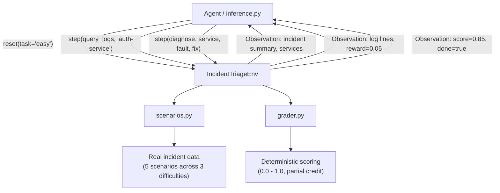
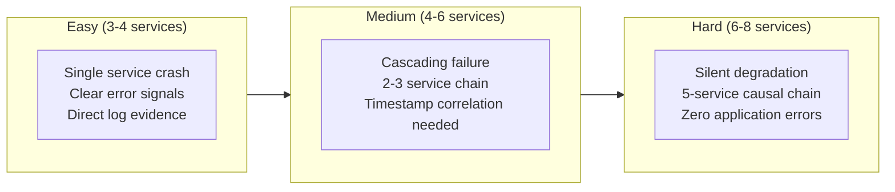
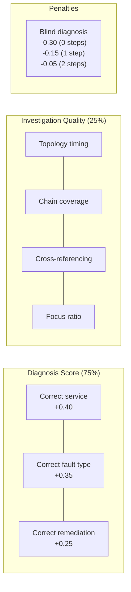

# Incident Triage Environment

An RL environment that simulates SRE incident triage across microservices. AI agents investigate production outages by querying logs, metrics, topology, traces, and alerts, then submit a root-cause diagnosis for scoring.

Built for the [OpenEnv Hackathon](https://openenvhackathon.com/) (Scaler + HuggingFace + Meta).

## Why This Exists

Every engineering team running microservices deals with production incidents. An SRE gets paged at 3am, opens dashboards, queries logs, checks which services depend on which, and tries to find the root cause before the outage gets worse.

This is a high-stakes reasoning task that happens thousands of times a day across the industry. Companies like PagerDuty, incident.io, and Observe are building AI tooling for exactly this. Yet no RL environment exists to train or evaluate agents on incident investigation.

This environment fills that gap. Every scenario is grounded in a documented real-world outage:

| Scenario Basis | What Happened | Our Mapping |
|---|---|---|
| **Common Java OOM** | JVM heap exhaustion, container OOMKilled | Easy: clear error logs, single service |
| **PostgreSQL disk full** | WAL logs filling disk, writes blocked | Easy: disk usage metrics, FATAL in logs |
| **mTLS cert expiry** | Certificate renewal failed, handshakes rejected | Easy: TLS errors trace to cert-manager |
| **GitHub Actions** | DB connection leak gradually exhausted pool | Medium: slow degradation, no error logs from leaker |
| **CrowdStrike 2024** | Bad config push crashed 8.5M machines simultaneously | Medium: config push with misleading per-service errors |
| **Slack 2020** | Autoscaler thundering herd overwhelmed config service | Medium: new instances can't bootstrap, config CPU 100% |
| **ML pipeline staleness** | Kafka disk full caused silent prediction degradation | Hard: zero errors, business metric is only signal |
| **Meta 2021** | BGP route withdrawal, monitoring also broken | Hard: monitoring blindness, stale metrics, DNS cascade |

## How It Works



## Quick Start

```bash
# Install
uv sync

# Validate
openenv validate

# Run tests
uv run python -m pytest tests/ -v

# Start server
uv run server

# Dry-run inference (no LLM needed)
INFERENCE_DRY_RUN=1 python inference.py
```

## Docker

```bash
docker build -f server/Dockerfile -t incident-triage-env .
docker run -p 8000:8000 incident-triage-env
```

## Deploy to HuggingFace Spaces

```bash
openenv push --repo-id your-username/incident-triage-env
```

## Tasks

Three difficulty levels with meaningful progression:



| Task | Services | Causal Chain | Baseline Score | What Makes It Hard |
|------|----------|-------------|---------------|-------------------|
| easy | 3-4 | 1-2 deep | 0.88 | Single service OOM, disk-full, or cert expiry. Logs point directly at fault. |
| medium | 4-6 | 2-4 deep | 0.68 | Cascading failure, thundering herd, config push. Timestamp correlation needed. |
| hard | 6-8 | 4-5 deep | 0.85 | Zero application errors, monitoring blindness. Business metric is only signal. |

## Action Space

Six investigation actions that mirror what real SREs do:

| Action | Parameters | Reward Signal |
|--------|-----------|--------------|
| `query_logs(service)` | `target_service: str` | +0.05 if service in causal chain (first time) |
| `query_metrics(service)` | `target_service: str` | +0.03 if service in causal chain (first time) |
| `check_topology()` | none | +0.02 (first time) |
| `trace_request(service)` | `target_service: str` (optional) | +0.04 if service in causal chain (first time) |
| `check_alerts()` | none | +0.03 (first time) |
| `diagnose(service, fault_type, remediation)` | all three required | 0.0 - 1.0 (see scoring) |

- Repeated identical queries: -0.01 (discourages loops)
- Invalid or malformed actions: -0.02
- Max 15 steps per episode

## Observation Space

| Field | Type | Description |
|-------|------|-------------|
| `incident_id` | string | Unique scenario identifier |
| `summary` | string | Alert text the on-call SRE received |
| `available_services` | list[string] | Services available to query |
| `available_actions` | list[string] | Action signatures with parameters |
| `response` | string | Result of the last action (logs, metrics, topology, etc.) |
| `step` | int | Current step number |
| `done` | bool | Whether the episode has ended |
| `reward` | float | Reward from the last action |
| `score` | float | Final diagnosis score (non-zero only after diagnose) |

## Scoring

The final score combines diagnosis accuracy (75%) and investigation quality (25%):



**Investigation quality scoring** rewards agents that follow good SRE methodology:
- Checking topology early (understanding the system)
- Investigating services in the causal chain
- Cross-referencing logs AND metrics for the same service
- Staying focused on relevant services (not querying everything)
- Following dependency links in investigation order

**Blind diagnosis penalty** scales with causal chain length -- harder scenarios need more investigation. Agents that diagnose with 0 investigation steps lose 0.17-0.40 from their score depending on scenario complexity.

| Component | Points | Condition |
|-----------|--------|-----------|
| Root-cause service correct | +0.40 | Exact match |
| Service in causal chain | +0.15 | Partial credit if not exact |
| Fault type correct | +0.35 | Only if service identified |
| Remediation correct | +0.25 | Only if service identified |
| Efficiency bonus | +0.05 | Diagnosed in 50% or fewer of max steps |

**Valid fault types:** `oom`, `cpu_saturated`, `connection_leak`, `disk_full`, `config_error`, `network_partition`, `dependency_timeout`, `certificate_expired`, `memory_leak`, `thread_deadlock`, `dns_failure`

**Valid remediations:** `restart`, `scale_up`, `fix_config`, `clear_disk`, `rollback`, `failover`, `increase_pool`, `renew_certificate`, `kill_threads`, `flush_dns`, `update_routes`, `resize_volume`

## Reward Shaping

Rewards are distributed throughout the episode, not just at diagnosis:

| Signal | Reward | When |
|--------|--------|------|
| Query logs of causal chain service | +0.05 | First time only |
| Query metrics of causal chain service | +0.03 | First time only |
| Check topology | +0.02 | First time only |
| Trace request through causal chain | +0.04 | First time only |
| Check alerts | +0.03 | First time only |
| Query irrelevant service | 0.00 | No penalty, no reward |
| Repeated query (same action + service) | -0.01 | Discourages loops |
| Invalid action | -0.02 | Missing fields, unknown type |
| Max steps without diagnosis | 0.00 | Episode ends with score 0 |

## Benchmark Results

Score ranges across all 8 scenarios with 3 play styles:

| Task | Scenarios | Perfect Play | Blind Guess | Wrong Diagnosis |
|------|-----------|-------------|-------------|-----------------|
| easy | 3 | 0.884 - 0.959 | 0.546 - 0.592 | 0.062 - 0.209 |
| medium | 3 | 0.853 - 0.865 | 0.458 - 0.505 | 0.065 - 0.148 |
| hard | 2 | 0.854 - 0.859 | 0.444 - 0.464 | 0.144 - 0.146 |

- **Perfect play**: check topology, query logs+metrics of root cause, then diagnose correctly
- **Blind guess**: diagnose correctly on step 1 with zero investigation (penalized, scales with chain length)
- **Wrong diagnosis**: investigate some services then diagnose wrong service/fault/remediation

Every scenario produces different scores for the same play style. Scores differentiate by scenario complexity (service count, causal chain depth).

Baseline results from `Qwen/Qwen3.5-27B` via HuggingFace router (2 runs, randomized scenarios):

| Run | Task | Scenario | Score | Steps |
|-----|------|----------|-------|-------|
| 1 | easy | easy-cert-001 | 0.772 | 5 |
| 1 | medium | medium-connleak-001 | 0.538 | 4 |
| 1 | hard | hard-kafka-staleness-001 | 0.924 | 7 |
| 2 | easy | easy-oom-001 | 0.748 | 3 |
| 2 | medium | medium-config-001 | 0.750 | 6 |
| 2 | hard | hard-network-blindspot-001 | 0.517 | 8 |

The monitoring-blindness hard scenario (0.517) is significantly harder than the staleness scenario (0.924), showing genuine difficulty variance across scenarios.

## Running Inference

```bash
export API_BASE_URL=https://router.huggingface.co/v1
export MODEL_NAME=Qwen/Qwen3.5-27B
export HF_TOKEN=hf_your_token
python inference.py
```

Output follows the mandatory `[START]`/`[STEP]`/`[END]` format:

```
[START] task=easy env=incident_triage model=Qwen/Qwen3.5-27B
[STEP] step=1 action=check_topology() reward=0.02 done=false error=null
[STEP] step=2 action=query_logs(auth-service) reward=0.05 done=false error=null
[STEP] step=3 action=diagnose(auth-service,oom,restart) reward=1.00 done=true error=null
[END] success=true steps=3 score=1.000 rewards=0.02,0.05,1.00
```

## API

The server uses `openenv create_app()` which provides HTTP, WebSocket, and MCP endpoints:

```bash
# Health check
curl http://localhost:8000/

# Reset (start new episode)
curl -X POST http://localhost:8000/reset \
  -H "Content-Type: application/json" \
  -d '{"task": "easy"}'

# Step
curl -X POST http://localhost:8000/step \
  -H "Content-Type: application/json" \
  -d '{"action": {"action_type": "check_topology"}}'

# State / Metadata / Schema
curl http://localhost:8000/state
curl http://localhost:8000/metadata
curl http://localhost:8000/schema
```

WebSocket for multi-step episodes:

```python
from client import IncidentTriageEnvClient
from models import IncidentAction

with IncidentTriageEnvClient(base_url="http://localhost:8000") as env:
    result = env.reset(task="easy")
    result = env.step(IncidentAction(action_type="query_logs", target_service="auth-service"))
    result = env.step(IncidentAction(
        action_type="diagnose", target_service="auth-service",
        fault_type="oom", remediation="restart",
    ))
```

## Project Structure

```
incident-triage-env/
├── models.py                    # Pydantic models (Action, Observation, Reward, Enums)
├── client.py                    # EnvClient for WebSocket connections
├── inference.py                 # Baseline LLM agent
├── openenv.yaml                 # OpenEnv manifest
├── pyproject.toml               # Dependencies
├── incident_triage_env/
│   ├── env.py                   # Core environment (reset/step/state)
│   ├── grader.py                # Deterministic scoring
│   ├── scenarios.py             # 8 scenarios across 3 difficulties (3+3+2)
│   ├── real_incidents.py        # Real post-mortem mappings
│   └── log_templates.py         # Realistic log generators (LogHub patterns)
├── server/
│   ├── app.py                   # FastAPI server (create_app)
│   ├── incident_triage_environment.py  # OpenEnv Environment adapter
│   └── Dockerfile               # Multi-stage build
├── tests/                       # 63 tests
└── scripts/
    ├── validate.sh              # Pre-submission validator (27 checks)
    ├── run_baseline.sh          # Run inference with logging
    └── deploy_hf.sh             # Deploy to HuggingFace Spaces
```

## Real-World Sources

All scenarios are grounded in documented production incidents:

- [LogHub](https://github.com/logpai/loghub) -- real log templates from 16 distributed systems
- [Dan Luu's post-mortems](https://github.com/danluu/post-mortems) -- 200+ real incident reports
- [Meta 2021 BGP outage](https://engineering.fb.com/2021/10/05/networking-traffic/outage-details/)
- [AWS 2021 us-east-1](https://aws.amazon.com/message/12721/)
- [CrowdStrike 2024](https://www.crowdstrike.com/blog/falcon-content-update-preliminary-post-incident-report/)
- [Google SRE Book](https://sre.google/books)
- [PagerDuty Response Guide](https://response.pagerduty.com)
