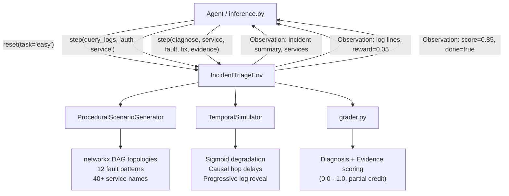
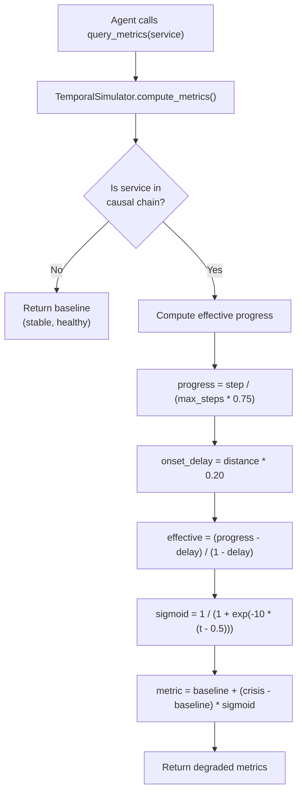
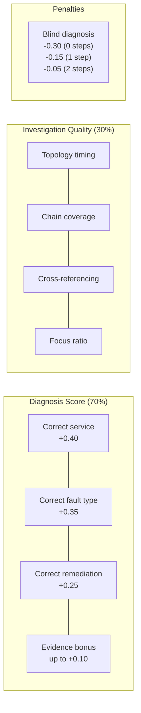

# Incident Triage Environment

A trace-informed synthetic benchmark for production SRE incident triage across microservice architectures. AI agents investigate production outages by querying logs, metrics, topology, traces, alerts, and runbooks, then submit a root-cause diagnosis with grounded evidence for scoring.

Service topologies are generated as directed acyclic graphs with hotspot services and variable path lengths, informed by empirical analyses of Alibaba-scale microservice call graphs (Luo et al., 2021). Metric and log degradation patterns are aligned with public anomaly datasets such as LogHub and AIOps KPI benchmarks. The environment exposes a graph-structured, multi-signal state (topology, logs, metrics, alerts, traces) designed to benchmark root-cause reasoning similar in spirit to frameworks like MicroHECL and CHASE, but in a lightweight, reproducible OpenEnv form.

Built for the [OpenEnv Hackathon](https://openenvhackathon.com/) (Scaler + HuggingFace + Meta).

## Why This Exists

Every engineering team running microservices deals with production incidents. An SRE gets paged at 3am, opens dashboards, queries logs, checks which services depend on which, and tries to find the root cause before the outage gets worse.

This is a high-stakes reasoning task that happens thousands of times a day across the industry. Companies like PagerDuty, incident.io, and Observe are building AI tooling for exactly this. Yet no RL environment exists to train or evaluate agents on incident investigation.

This environment fills that gap. It is a controlled, high-fidelity simulator -- not a replay of raw production data, but a procedural engine whose topology, degradation, and fault structures are grounded in peer-reviewed microservice trace studies and real-world post-mortems. Three design choices make it suitable as an RL training ground:

1. **Procedural generation** produces infinite unique scenarios via networkx DAGs, preventing the memorization problem documented in Procgen (Cobbe et al., 2020)
2. **Temporal simulation** makes incidents cascade over time via sigmoid degradation curves, aligned with KPI anomaly patterns from AIOps benchmarks (He et al., 2023)
3. **Explainable AI scoring** rewards agents that cite grounded evidence for their diagnosis, mirroring the multi-signal root-cause analysis paradigm of MicroHECL (Li et al., 2022) and CHASE (Wang et al., 2023)

## How It Works



Services are tagged with **criticality tiers** (Tier 1 = critical infrastructure, Tier 2 = application, Tier 3 = observability) visible in topology output. Agents can consult per-service **runbooks** listing known failure modes and standard remediation, just like real SREs.

### Temporal Degradation Model

Metrics degrade along sigmoid curves. Services further from the root cause start degrading later. The agent is investigating a moving target.



### Difficulty Progression

```mermaid
flowchart LR
    subgraph Easy["Easy"]
        E1["3-4 services"]
        E2["1-2 deep chain"]
        E3["Clear error logs"]
        E4["OOM, disk full, cert expiry"]
    end

    subgraph Medium["Medium"]
        M1["4-6 services"]
        M2["2-4 deep chain"]
        M3["Red herrings + noise alerts"]
        M4["Connection leak, config push, thundering herd"]
    end

    subgraph Hard["Hard"]
        H1["6-9 services"]
        H2["3-5 deep chain"]
        H3["Monitoring blindness + stale metrics"]
        H4["Kafka staleness, DNS failure, memory leak, deadlock"]
    end

    Easy --> Medium --> Hard
```



## Quick Start

```bash
# Install
uv sync

# Validate
openenv validate

# Run tests
uv run python -m pytest tests/ -v

# Start server
uv run server

# Dry-run inference (no LLM needed)
INFERENCE_DRY_RUN=1 python inference.py
```

## Docker

```bash
docker build -f server/Dockerfile -t incident-triage-env .
docker run -p 8000:8000 incident-triage-env
```

## Deploy to HuggingFace Spaces

```bash
openenv push --repo-id your-username/incident-triage-env
```

## Procedural Scenario Generation

The environment does not use static, hardcoded scenarios. Every call to `reset()` generates a fresh scenario using the `ProceduralScenarioGenerator`, which composes incidents from constrained building blocks.

### networkx DAG Topologies

Service dependency graphs are generated as Directed Acyclic Graphs using `networkx`. The topology structure is informed by empirical analyses of production microservice call graphs at Alibaba scale, which show that real service dependencies form heavy-tailed, tree-like DAGs with hotspot services and substantial topological variability (Luo et al., 2021). Our generator reproduces these properties: degree distributions, path lengths, and fan-out patterns fall within the ranges reported in production trace studies, while remaining fully procedural and deterministic.

Each topology is validated with `nx.is_directed_acyclic_graph()`. The generator selects services from a curated pool of 40+ realistic microservice names across 6 architectural layers (gateway, application, data, infrastructure, observability, ML) and wires them into difficulty-appropriate shapes:

| Difficulty | Services | Topology Shape | Causal Chain | Characteristics |
|---|---|---|---|---|
| easy | 3-4 | Linear chain | 1-2 deep | Single service fault, clear signals |
| medium | 4-6 | Fanout with bottleneck | 2-4 deep | Cascading failure, red-herring bystanders |
| hard | 6-9 | Deep tree, multiple paths | 3-5 deep | Monitoring blindness, stale metrics |

### 12 Fault Patterns

Each pattern defines a fault type, remediation, log category, metric signature, and cascade behavior:

| Pattern | Fault Type | Remediation | Cascade Effect | Real-World Basis |
|---|---|---|---|---|
| java-oom | oom | restart | error_propagation | Spring Boot/Kafka/Elasticsearch OOM |
| disk-full-db | disk_full | clear_disk | error_propagation | PostgreSQL WAL accumulation |
| disk-full-kafka | disk_full | clear_disk | stale_data | Kafka log segment exhaustion |
| connection-leak | connection_leak | increase_pool | connection_exhaust | GitHub Actions DB leaks |
| config-push | config_error | rollback | error_propagation | CrowdStrike 2024 |
| cert-expired | certificate_expired | renew_certificate | error_propagation | mTLS cert rotation failures |
| thundering-herd | cpu_saturated | scale_up | timeout | Slack 2020 provisioning storm |
| dns-failure | dns_failure | flush_dns | error_propagation | Meta 2021 BGP outage |
| memory-leak | memory_leak | restart | timeout | Gradual heap exhaustion |
| thread-deadlock | thread_deadlock | kill_threads | timeout | Thread pool starvation |
| network-partition | network_partition | update_routes | error_propagation | Cloud split-brain scenarios |
| dependency-timeout | dependency_timeout | failover | timeout | Service mesh cascade stalls |

### Infinite Replayability

The generator uses Python's `random.Random` with optional seeding. Without a seed, every `reset()` produces a unique scenario. With a seed, scenarios are deterministically reproducible for benchmarking.

```python
# Unique scenario every time
env.reset()

# Reproducible scenario
gen = ProceduralScenarioGenerator(seed=42)
scenario = gen.generate("medium")
```

## Temporal Simulation and Cascading Failures

This is not a static environment. The incident state evolves as the agent takes steps. The degradation model produces spikes, drifts, and cascading failures aligned with the anomaly types catalogued in AIOps KPI benchmark datasets (He et al., 2023) and multi-modal anomaly detection research (LogHub, Zhu et al., 2023).

### Sigmoid Degradation Curves

Metrics are mathematically computed at each step using sigmoid interpolation between healthy baselines and crisis values:

```
sigmoid(t) = 1 / (1 + exp(-10 * (t - 0.5)))
metric(step) = baseline + (crisis - baseline) * sigmoid(effective_progress)
```

This produces realistic degradation: slow onset, rapid escalation in the middle, and plateau near crisis values.

For example, a root cause service's error rate might evolve:
- Step 0: 1.2% (baseline)
- Step 3: 5.8% (early warning)
- Step 6: 48.3% (rapid escalation)
- Step 9: 91.7% (near crisis)
- Step 12: 99.8% (full crisis)

### Causal Hop Delays

Services further from the root cause in the dependency chain experience delayed degradation. Each hop adds a 20% delay to the onset of symptoms:

- Root cause (distance 0): degrades immediately
- Direct dependent (distance 1): 20% delay before onset
- Second hop (distance 2): 40% delay before onset

This means an agent investigating at step 2 might see the root cause already failing while downstream services still look healthy. By step 8, the cascade has spread through the entire chain.

### Progressive Log Revelation

Logs for causal chain services reveal progressively. At early steps, only the first few log lines are visible. As the incident progresses, more evidence appears. Non-causal "bystander" services show their full (healthy) logs from step 0, acting as realistic noise.

## Explainable AI Scoring

The `diagnose` action accepts an optional `hypothesis_evidence` parameter where agents cite the specific log lines, metric values, or timestamps that led to their conclusion.

```json
{
    "action_type": "diagnose",
    "target_service": "postgres-db",
    "fault_type": "disk_full",
    "remediation": "clear_disk",
    "hypothesis_evidence": "postgres-db disk_usage_pct at 100%, FATAL: No space left on device at 10:14:55Z"
}
```

The grader awards up to +0.10 bonus for quality evidence:
- +0.05 if the evidence references the root cause service by name
- +0.02 per matching signal keyword (max +0.05): e.g., "OutOfMemoryError", "heap", "disk full", "pool exhausted"

This rewards agents that build transparent, verifiable reasoning chains rather than guessing.

## Action Space

Seven investigation actions that mirror what real SREs do:

| Action | Parameters | Reward Signal |
|--------|-----------|--------------|
| `query_logs(service)` | `target_service: str` | +0.05 if service in causal chain (first time) |
| `query_metrics(service)` | `target_service: str` | +0.03 if service in causal chain (first time) |
| `check_topology()` | none | +0.02 (first time) |
| `trace_request(service)` | `target_service: str` (optional) | +0.04 if service in causal chain (first time) |
| `check_alerts()` | none | +0.03 (first time) |
| `check_runbook(service)` | `target_service: str` | +0.02 if service in causal chain (first time) |
| `diagnose(service, fault_type, remediation, evidence)` | all required except evidence | 0.0 - 1.0 (see scoring) |

- Repeated identical queries: -0.01 (discourages loops)
- Invalid or malformed actions: -0.02
- Invalid fault_type or remediation in diagnose: -0.02 (agent can retry)
- Max 15 steps per episode

## Observation Space

| Field | Type | Description |
|-------|------|-------------|
| `incident_id` | string | Unique scenario identifier |
| `summary` | string | Alert text the on-call SRE received |
| `available_services` | list[string] | Services available to query |
| `available_actions` | list[string] | Action signatures with parameters |
| `response` | string | Result of the last action (evolves with temporal state) |
| `step` | int | Current step number |
| `done` | bool | Whether the episode has ended |
| `score` | float | Final diagnosis score (non-zero only after diagnose) |

## Scoring

The final score combines diagnosis accuracy (70%) and investigation quality (30%):



**Investigation quality scoring** rewards agents that follow good SRE methodology:
- Checking topology early (understanding the system)
- Investigating services in the causal chain
- Cross-referencing logs AND metrics for the same service
- Staying focused on relevant services (not querying everything)
- Following dependency links in investigation order

**Blind diagnosis penalty** scales with causal chain length. Harder scenarios need more investigation. Uses unique (action, service) pairs to prevent exploit via repeated identical actions.

**Evidence bonus** rewards transparent reasoning. Agents that cite specific log lines or metric values from the root cause service score up to +0.10 higher.

| Component | Points | Condition |
|-----------|--------|-----------|
| Root-cause service correct | +0.40 | Exact match |
| Service in causal chain | +0.15 | Partial credit if not exact |
| Fault type correct | +0.35 | Only if service identified |
| Remediation correct | +0.25 | Only if service identified |
| Evidence bonus | up to +0.10 | Root service cited + signal keywords |
| Criticality adjustment | +0.02 / -0.03 | Tier 1 correct gets bonus, Tier 1 wrong gets penalty |
| Efficiency bonus | +0.05 | Diagnosed in 50% or fewer of max steps |

**Valid fault types:** `oom`, `cpu_saturated`, `connection_leak`, `disk_full`, `config_error`, `network_partition`, `dependency_timeout`, `certificate_expired`, `memory_leak`, `thread_deadlock`, `dns_failure`

**Valid remediations:** `restart`, `scale_up`, `fix_config`, `clear_disk`, `rollback`, `failover`, `increase_pool`, `renew_certificate`, `kill_threads`, `flush_dns`, `update_routes`, `resize_volume`

## Reward Shaping

Rewards are distributed throughout the episode, not just at diagnosis:

| Signal | Reward | When |
|--------|--------|------|
| Query logs of causal chain service | +0.05 | First time only |
| Query metrics of causal chain service | +0.03 | First time only |
| Check topology | +0.02 | First time only |
| Trace request through causal chain | +0.04 | First time only |
| Check alerts | +0.03 | First time only |
| Check runbook of causal chain service | +0.02 | First time only |
| Query irrelevant service | 0.00 | No penalty, no reward |
| Repeated query (same action + service) | -0.01 | Discourages loops |
| Invalid action | -0.02 | Missing fields, unknown type |
| Max steps without diagnosis | 0.00 | Episode ends with score 0 |

## Model Capability Benchmarks

Ablation study across 5 models ranging from 17B to frontier-class, tested against the procedural generation engine with evidence grounding and anti-reward-hacking protections enabled. Each model ran all three task difficulties (easy/medium/hard). The evaluation mirrors the multi-signal root-cause analysis paradigm used by SOTA frameworks like MicroHECL and CHASE: agents must combine graph topology, temporal metrics, log evidence, and alert signals to localize faults, rather than relying on any single modality. Full run logs are in `outputs/ablation/`.

### Score Comparison

| Model | Parameters | Easy | Medium | Hard | Avg | Steps (avg) |
|---|---|---|---|---|---|---|
| Llama 4 Scout | 17B MoE | 0.77 | 0.88 | 0.74 | 0.80 | 6 |
| Qwen3 | 32B | 0.96 | 0.86 | 0.32 | 0.71 | 4 |
| Llama 3.3 | 70B | 0.78 | **0.97** | 0.86 | 0.87 | 7 |
| Gemini 2.5 Flash | Frontier | 0.89 | 0.93 | 0.85 | **0.89** | 5 |
| Claude Haiku 4.5 | Frontier | 0.77 | 0.96 | **0.91** | 0.88 | 9 |

### Key Findings

**The hardened grader produces wider score spreads.** Hard task scores range from 0.32 (Qwen3 32B) to 0.91 (Claude Haiku 4.5), a 0.59 spread. Evidence grounding verification and input validation prevent agents from gaming scores through hallucinated citations or keyword stuffing.

**Investigation depth correlates with score on hard tasks.** Claude Haiku 4.5 consistently used 9 steps, cross-referencing logs and metrics and citing grounded evidence. Qwen3 diagnosed in 4 steps on hard, misidentified the fault type, and scored 0.32. The blind diagnosis penalty and evidence grounding combine to punish shallow investigation.

**Frontier models use runbooks.** Both Claude Haiku and Gemini discovered and used the `check_runbook` action without being explicitly told to. Smaller models ignored it entirely. This emergent behavior demonstrates the environment rewards methodical investigation.

**Observed behavioral differences across tiers:**
- **Small models (17B-32B)**: Diagnose in 3-5 steps. Identify the right service but miss fault type nuances. Qwen3 scored 0.96 on easy but collapsed to 0.32 on hard, showing the environment genuinely scales with reasoning depth.
- **Large models (70B)**: Follow the dependency chain methodically. Cross-reference logs and metrics. Llama 3.3 scored 0.97 on medium by investigating 5 different services before diagnosing.
- **Frontier models**: Exhaustive investigation. Check topology, query causal chain services' logs AND metrics, use trace_request and check_runbook, and cite exact log lines and metric values. Earn investigation quality bonuses and grounded evidence bonuses.

**Anti-reward-hacking in action:**
- Evidence grounding blocks hallucinated citations (agent must have queried the service it cites)
- Keyword stuffing detection halves evidence bonus when agents shotgun keywords from 3+ fault types
- Input validation rejects invalid fault types and remediations, letting agents retry instead of silently scoring 0
- The grader produces meaningful variance: wrong diagnosis = 0.01, blind guess = ~0.30, investigated + correct = 0.77-0.97

For the full evolution of how this environment and its scores developed across 30+ commits -- including the shortcut learning anomaly, reward hacking research, and phase-by-phase scoring analysis -- see [docs/SCORING_ANALYSIS.md](docs/SCORING_ANALYSIS.md).

## Running Inference

```bash
export API_BASE_URL=https://router.huggingface.co/v1
export MODEL_NAME=Qwen/Qwen3.5-27B
export HF_TOKEN=hf_your_token
python inference.py
```

Output follows the mandatory `[START]`/`[STEP]`/`[END]` format:

```
[START] task=medium env=incident_triage model=anthropic/claude-haiku-4-5-20251001
[STEP] step=1 action=check_topology() reward=0.02 done=false error=null
[STEP] step=2 action=query_metrics(kafka-broker) reward=0.03 done=false error=null
[STEP] step=3 action=query_logs(kafka-broker) reward=0.05 done=false error=null
[STEP] step=4 action=check_alerts() reward=0.03 done=false error=null
[STEP] step=5 action=check_runbook(kafka-broker) reward=0.02 done=false error=null
...
[STEP] step=9 action=diagnose(kafka-broker,cpu_saturated,scale_up,Alert [P1] Cpu-SaturatedDetected...) reward=0.96 done=true error=null
[END] success=true steps=9 rewards=0.02,0.03,0.05,0.03,0.02,0.05,0.05,0.03,0.96
```

## API

The server uses `openenv create_app()` which provides HTTP, WebSocket, and MCP endpoints:

```bash
# Health check
curl http://localhost:8000/

# Reset (start new episode -- generates fresh scenario)
curl -X POST http://localhost:8000/reset \
  -H "Content-Type: application/json" \
  -d '{"task": "easy"}'

# Step
curl -X POST http://localhost:8000/step \
  -H "Content-Type: application/json" \
  -d '{"action": {"action_type": "check_topology"}}'

# State / Metadata / Schema
curl http://localhost:8000/state
curl http://localhost:8000/metadata
curl http://localhost:8000/schema
```

## Project Structure

```
incident-triage-env/
├── models.py                    # Pydantic models (Action with hypothesis_evidence, Observation)
├── client.py                    # EnvClient for WebSocket connections
├── inference.py                 # Baseline LLM agent with temporal-aware prompting
├── openenv.yaml                 # OpenEnv manifest
├── pyproject.toml               # Dependencies (includes networkx)
├── incident_triage_env/
│   ├── env.py                   # Core environment (reset/step/state)
│   ├── generator.py             # ProceduralScenarioGenerator (networkx DAG topologies)
│   ├── temporal.py              # TemporalSimulator (sigmoid degradation, causal delays)
│   ├── grader.py                # Deterministic scoring with evidence + criticality bonus
│   ├── scenarios.py             # Scenario accessor (delegates to generator)
│   ├── real_incidents.py        # Real post-mortem mappings
│   └── log_templates.py         # Realistic log generators (LogHub patterns)
├── server/
│   ├── app.py                   # FastAPI server (create_app)
│   ├── incident_triage_environment.py  # OpenEnv Environment adapter
│   └── Dockerfile               # Multi-stage build
├── tests/                       # 177 tests
│   ├── test_generator.py        # Generator + criticality + runbook tests (57 tests)
│   ├── test_temporal.py         # Temporal degradation tests (15 tests)
│   ├── test_env.py              # Environment + robustness tests (48 tests)
│   ├── test_grader.py           # Grading + evidence grounding tests (26 tests)
│   ├── test_scenarios.py        # Scenario pool tests (16 tests)
│   └── test_api.py              # HTTP/WS endpoint tests (10 tests)
├── docs/
│   └── ARCHITECTURE.md          # Detailed architecture diagrams
└── scripts/
    ├── validate.sh              # Pre-submission validator
    ├── run_baseline.sh          # Run inference with logging
    └── deploy_hf.sh             # Deploy to HuggingFace Spaces
```

## Future Scope

The current environment is a deterministic, trace-informed simulation optimized for the 2 vCPU / 8GB RAM evaluation constraint. The most immediate V2 path is a **trace-calibrated generator** that fits DAG degree distributions and latency curves to statistics extracted from Alibaba microservice trace datasets (Luo et al., 2021), and a **trace-replay mode** that loads preprocessed KPI segments from AIOps benchmarks into the temporal simulator. Beyond that, several architecturally validated extensions would push this toward a full research-grade benchmark.

### Live Container Orchestration

Replace text-based metric generation with actual Docker containers. The procedural generator would emit a `docker-compose.yml` instead of a Python dict. Fault injection becomes real: `dd if=/dev/zero` for disk_full, `tc qdisc` for network latency, `stress-ng` for CPU saturation. The agent's action space shifts from `query_metrics("service")` to `execute_bash("service", "df -h")`. This bridges the gap between simulating symptoms and executing diagnostics, following the approach of OSWorld and SWE-bench.

### Adversarial Chaos Agent

Transform the environment into a two-player Markov game. While the SRE agent investigates, a background Chaos Agent injects new faults in response to the agent's progress. If the agent focuses on the database, the Chaos Agent kills the API gateway. This forces the agent to handle concurrent alerts and prioritize under active sabotage, similar to Netflix's Chaos Monkey but as an RL adversary. The temporal simulator's passive sigmoid degradation becomes active and adversarial.

### Post-Diagnosis Verification Phase

Currently, `diagnose` ends the episode. In V2, the episode continues: the agent must monitor the system for N subsequent steps to verify metrics return to baseline. If the agent restarts a service but the memory leak recurs 3 steps later (because the root fix was a config patch, not a restart), the episode fails. This tests whether agents understand the difference between symptom relief and root cause resolution.

### Nested Remediation Environments

After correct diagnosis, drop the agent into a nested sub-environment where it must execute the actual fix. For `config_error`, the agent edits a YAML file. For `certificate_expired`, it runs `certbot renew`. The grader evaluates the exit code and post-fix system state rather than string-matching a remediation label. This extends the action space from discrete choices to freeform command execution.

### Multi-Agent Delegation

Split the action space across specialized roles: a Logs Specialist (can only `query_logs`), a Metrics Specialist (can only `query_metrics`), and a Lead SRE that coordinates by sending natural language requests. The grader penalizes excessive communication overhead, forcing precise delegation. This evaluates team orchestration rather than individual reasoning, following the MetaGPT/ChatDev paradigm.

### Compliance Constraints

Add regulatory boundaries. Tier 1 services (databases with PII) require the agent to check a runbook and log an audit trail before querying. Querying a restricted service without authorization terminates the episode with score 0. This tests whether agents can operate under compliance constraints while maintaining diagnostic speed.

These extensions are not viable under the current hackathon's 8GB/20-minute constraints but represent a clear path toward a publishable benchmark for autonomous SRE agents.

## Research Grounding and Real-World Sources

### Academic References

The environment's design choices are informed by peer-reviewed research on microservice observability and root-cause analysis:

- **Alibaba Microservice Traces** -- Luo et al., "Characterizing Microservice Dependency and Performance: Alibaba Trace Analysis" (ACM SoCC 2021). Informs our DAG topology structure: heavy-tailed degree distributions, hotspot services, variable path lengths.
- **LogHub** -- Zhu et al., "Loghub: A Large Collection of System Log Datasets for AI-driven Log Analytics" (2023). Our log templates are aligned with patterns from this corpus of 16 distributed system logs.
- **AIOps KPI Benchmarks** -- He et al., "A Survey on Automated Log Analysis for Reliability Engineering" (ACM Computing Surveys 2023). Our temporal degradation model produces anomaly types (spikes, drifts, cascading failures) consistent with these operational datasets.
- **MicroHECL** -- Li et al., "Actionable and Interpretable Fault Localization for Recurring Failures in Online Service Systems" (FSE 2022). Graph-based multi-signal RCA at Alibaba scale. Our environment mirrors this evaluation paradigm: agents must combine topology, metrics, and logs.
- **CHASE** -- Wang et al., "Root Cause Analysis for Microservice Systems via Hierarchical Reinforcement Learning and Causal Inference" (2023). Causal heterogeneous graph framework for multi-modal RCA. Our causal chain scoring and evidence grounding are structurally aligned.
- **Procgen** -- Cobbe et al., "Leveraging Procedural Generation to Benchmark Reinforcement Learning" (NeurIPS 2020). Procedural generation prevents RL agents from memorizing fixed evaluation sets. Our generator follows this principle.

### Production Incident Sources

All fault patterns are grounded in documented production incidents:

- [LogHub](https://github.com/logpai/loghub) -- real log templates from 16 distributed systems
- [Dan Luu's post-mortems](https://github.com/danluu/post-mortems) -- 200+ real incident reports
- [Meta 2021 BGP outage](https://engineering.fb.com/2021/10/05/networking-traffic/outage-details/)
- [AWS 2021 us-east-1](https://aws.amazon.com/message/12721/)
- [CrowdStrike 2024](https://www.crowdstrike.com/blog/falcon-content-update-preliminary-post-incident-report/)
- [Google SRE Book](https://sre.google/books)
- [PagerDuty Response Guide](https://response.pagerduty.com)
