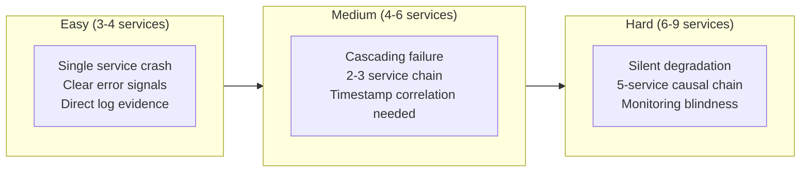
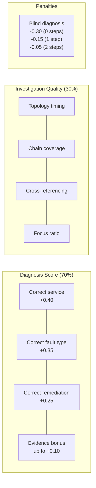

# Incident Triage Environment

An RL environment that simulates SRE incident triage across microservices. AI agents investigate production outages by querying logs, metrics, topology, traces, and alerts, then submit a root-cause diagnosis with supporting evidence for scoring.

Built for the [OpenEnv Hackathon](https://openenvhackathon.com/) (Scaler + HuggingFace + Meta).

## Why This Exists

Every engineering team running microservices deals with production incidents. An SRE gets paged at 3am, opens dashboards, queries logs, checks which services depend on which, and tries to find the root cause before the outage gets worse.

This is a high-stakes reasoning task that happens thousands of times a day across the industry. Companies like PagerDuty, incident.io, and Observe are building AI tooling for exactly this. Yet no RL environment exists to train or evaluate agents on incident investigation.

This environment fills that gap with three key innovations:

1. **Procedural generation** produces infinite unique scenarios, preventing RL overfitting
2. **Temporal simulation** makes incidents cascade over time via sigmoid degradation curves
3. **Explainable AI scoring** rewards agents that cite evidence for their diagnosis

## How It Works


## Quick Start

```bash
# Install
uv sync

# Validate
openenv validate

# Run tests
uv run python -m pytest tests/ -v

# Start server
uv run server

# Dry-run inference (no LLM needed)
INFERENCE_DRY_RUN=1 python inference.py
```

## Docker

```bash
docker build -f server/Dockerfile -t incident-triage-env .
docker run -p 8000:8000 incident-triage-env
```

## Deploy to HuggingFace Spaces

```bash
openenv push --repo-id your-username/incident-triage-env
```

## Procedural Scenario Generation

The environment does not use static, hardcoded scenarios. Every call to `reset()` generates a fresh scenario using the `ProceduralScenarioGenerator`, which composes incidents from constrained building blocks.

### networkx DAG Topologies

Service dependency graphs are generated as Directed Acyclic Graphs using `networkx`. Each topology is validated with `nx.is_directed_acyclic_graph()`. The generator selects services from a curated pool of 40+ realistic microservice names across 6 architectural layers (gateway, application, data, infrastructure, observability, ML) and wires them into difficulty-appropriate shapes:

| Difficulty | Services | Topology Shape | Causal Chain | Characteristics |
|---|---|---|---|---|
| easy | 3-4 | Linear chain | 1-2 deep | Single service fault, clear signals |
| medium | 4-6 | Fanout with bottleneck | 2-4 deep | Cascading failure, red-herring bystanders |
| hard | 6-9 | Deep tree, multiple paths | 3-5 deep | Monitoring blindness, stale metrics |

### 10 Fault Patterns

Each pattern defines a fault type, remediation, log category, metric signature, and cascade behavior:

| Pattern | Fault Type | Remediation | Cascade Effect | Real-World Basis |
|---|---|---|---|---|
| java-oom | oom | restart | error_propagation | Spring Boot/Kafka/Elasticsearch OOM |
| disk-full-db | disk_full | clear_disk | error_propagation | PostgreSQL WAL accumulation |
| disk-full-kafka | disk_full | clear_disk | stale_data | Kafka log segment exhaustion |
| connection-leak | connection_leak | increase_pool | connection_exhaust | GitHub Actions DB leaks |
| config-push | config_error | rollback | error_propagation | CrowdStrike 2024 |
| cert-expired | certificate_expired | renew_certificate | error_propagation | mTLS cert rotation failures |
| thundering-herd | cpu_saturated | scale_up | timeout | Slack 2020 provisioning storm |
| dns-failure | dns_failure | flush_dns | error_propagation | Meta 2021 BGP outage |
| memory-leak | memory_leak | restart | timeout | Gradual heap exhaustion |
| thread-deadlock | thread_deadlock | kill_threads | timeout | Thread pool starvation |

### Infinite Replayability

The generator uses Python's `random.Random` with optional seeding. Without a seed, every `reset()` produces a unique scenario. With a seed, scenarios are deterministically reproducible for benchmarking.

```python
# Unique scenario every time
env.reset()

# Reproducible scenario
gen = ProceduralScenarioGenerator(seed=42)
scenario = gen.generate("medium")
```

## Temporal Simulation and Cascading Failures

This is not a static environment. The incident state evolves as the agent takes steps.

### Sigmoid Degradation Curves

Metrics are mathematically computed at each step using sigmoid interpolation between healthy baselines and crisis values:

```
sigmoid(t) = 1 / (1 + exp(-10 * (t - 0.5)))
metric(step) = baseline + (crisis - baseline) * sigmoid(effective_progress)
```

This produces realistic degradation: slow onset, rapid escalation in the middle, and plateau near crisis values.

For example, a root cause service's error rate might evolve:
- Step 0: 1.2% (baseline)
- Step 3: 5.8% (early warning)
- Step 6: 48.3% (rapid escalation)
- Step 9: 91.7% (near crisis)
- Step 12: 99.8% (full crisis)

### Causal Hop Delays

Services further from the root cause in the dependency chain experience delayed degradation. Each hop adds a 20% delay to the onset of symptoms:

- Root cause (distance 0): degrades immediately
- Direct dependent (distance 1): 20% delay before onset
- Second hop (distance 2): 40% delay before onset

This means an agent investigating at step 2 might see the root cause already failing while downstream services still look healthy. By step 8, the cascade has spread through the entire chain.

### Progressive Log Revelation

Logs for causal chain services reveal progressively. At early steps, only the first few log lines are visible. As the incident progresses, more evidence appears. Non-causal "bystander" services show their full (healthy) logs from step 0, acting as realistic noise.

## Explainable AI Scoring

The `diagnose` action accepts an optional `hypothesis_evidence` parameter where agents cite the specific log lines, metric values, or timestamps that led to their conclusion.

```json
{
    "action_type": "diagnose",
    "target_service": "postgres-db",
    "fault_type": "disk_full",
    "remediation": "clear_disk",
    "hypothesis_evidence": "postgres-db disk_usage_pct at 100%, FATAL: No space left on device at 10:14:55Z"
}
```

The grader awards up to +0.10 bonus for quality evidence:
- +0.05 if the evidence references the root cause service by name
- +0.02 per matching signal keyword (max +0.05): e.g., "OutOfMemoryError", "heap", "disk full", "pool exhausted"

This rewards agents that build transparent, verifiable reasoning chains rather than guessing.

## Tasks

Three difficulty levels with meaningful progression:



## Action Space

Seven investigation actions that mirror what real SREs do:

| Action | Parameters | Reward Signal |
|--------|-----------|--------------|
| `query_logs(service)` | `target_service: str` | +0.05 if service in causal chain (first time) |
| `query_metrics(service)` | `target_service: str` | +0.03 if service in causal chain (first time) |
| `check_topology()` | none | +0.02 (first time) |
| `trace_request(service)` | `target_service: str` (optional) | +0.04 if service in causal chain (first time) |
| `check_alerts()` | none | +0.03 (first time) |
| `diagnose(service, fault_type, remediation, hypothesis_evidence)` | all required except evidence | 0.0 - 1.0 (see scoring) |

- Repeated identical queries: -0.01 (discourages loops)
- Invalid or malformed actions: -0.02
- Max 15 steps per episode

## Observation Space

| Field | Type | Description |
|-------|------|-------------|
| `incident_id` | string | Unique scenario identifier |
| `summary` | string | Alert text the on-call SRE received |
| `available_services` | list[string] | Services available to query |
| `available_actions` | list[string] | Action signatures with parameters |
| `response` | string | Result of the last action (evolves with temporal state) |
| `step` | int | Current step number |
| `done` | bool | Whether the episode has ended |
| `reward` | float | Reward from the last action |
| `score` | float | Final diagnosis score (non-zero only after diagnose) |

## Scoring

The final score combines diagnosis accuracy (70%) and investigation quality (30%):



**Investigation quality scoring** rewards agents that follow good SRE methodology:
- Checking topology early (understanding the system)
- Investigating services in the causal chain
- Cross-referencing logs AND metrics for the same service
- Staying focused on relevant services (not querying everything)
- Following dependency links in investigation order

**Blind diagnosis penalty** scales with causal chain length. Harder scenarios need more investigation. Uses unique (action, service) pairs to prevent exploit via repeated identical actions.

**Evidence bonus** rewards transparent reasoning. Agents that cite specific log lines or metric values from the root cause service score up to +0.10 higher.

| Component | Points | Condition |
|-----------|--------|-----------|
| Root-cause service correct | +0.40 | Exact match |
| Service in causal chain | +0.15 | Partial credit if not exact |
| Fault type correct | +0.35 | Only if service identified |
| Remediation correct | +0.25 | Only if service identified |
| Evidence bonus | up to +0.10 | Root service cited + signal keywords |
| Efficiency bonus | +0.05 | Diagnosed in 50% or fewer of max steps |

**Valid fault types:** `oom`, `cpu_saturated`, `connection_leak`, `disk_full`, `config_error`, `network_partition`, `dependency_timeout`, `certificate_expired`, `memory_leak`, `thread_deadlock`, `dns_failure`

**Valid remediations:** `restart`, `scale_up`, `fix_config`, `clear_disk`, `rollback`, `failover`, `increase_pool`, `renew_certificate`, `kill_threads`, `flush_dns`, `update_routes`, `resize_volume`

## Reward Shaping

Rewards are distributed throughout the episode, not just at diagnosis:

| Signal | Reward | When |
|--------|--------|------|
| Query logs of causal chain service | +0.05 | First time only |
| Query metrics of causal chain service | +0.03 | First time only |
| Check topology | +0.02 | First time only |
| Trace request through causal chain | +0.04 | First time only |
| Check alerts | +0.03 | First time only |
| Query irrelevant service | 0.00 | No penalty, no reward |
| Repeated query (same action + service) | -0.01 | Discourages loops |
| Invalid action | -0.02 | Missing fields, unknown type |
| Max steps without diagnosis | 0.00 | Episode ends with score 0 |

## Model Capability Benchmarks

Ablation study across 5 models ranging from 17B to frontier-class, tested against the procedural generation engine. Each model ran all three task difficulties (easy/medium/hard). Full run logs are in `outputs/ablation/`.

### Score Comparison

| Model | Parameters | Easy | Medium | Hard | Avg | Steps (avg) |
|---|---|---|---|---|---|---|
| Llama 4 Scout | 17B MoE | 0.95 | 0.82 | 0.70 | 0.82 | 6 |
| Qwen3 | 32B | 0.96 | 0.77 | 0.80 | 0.84 | 4 |
| Llama 3.3 | 70B | 0.76 | 0.81 | 0.92 | 0.83 | 7 |
| Gemini 2.5 Flash | Frontier | 0.78 | 0.83 | 0.78 | 0.80 | 7 |
| Claude Haiku 4.5 | Frontier | **0.96** | **0.97** | **0.93** | **0.95** | 10 |

### Key Findings

**The environment differentiates model capability on hard tasks.** Hard task scores range from 0.70 (Llama 4 Scout 17B) to 0.93 (Claude Haiku 4.5), a 0.23 spread that proves the environment is not trivially solvable.

**Investigation depth correlates with score.** Claude Haiku 4.5 consistently used 10 steps, cross-referencing logs and metrics for the same services and citing specific evidence. Smaller models diagnosed in 3-5 steps, often skipping the cross-referencing that earns investigation quality points.

**Observed behavioral differences across tiers:**
- **Small models (17B)**: Diagnose quickly with minimal investigation. Get the root cause right but miss fault type nuances. Weak evidence citations ("dns_failure error log" vs specific timestamps).
- **Medium models (32-70B)**: Better causal chain navigation. Cross-reference logs and metrics. Sometimes misidentify fault type on medium/hard scenarios.
- **Frontier models**: Exhaustive investigation. Check topology, query every causal chain service's logs AND metrics, use trace_request, and cite exact log lines and metric values in evidence. Earn both investigation quality bonuses and evidence bonuses.

**The grader produces meaningful score variance:**
- Wrong diagnosis: 0.01
- Blind diagnosis (no investigation): ~0.50
- Investigated + correct diagnosis: 0.76-0.97
- Perfect investigation + evidence: 0.93-0.97

## Running Inference

```bash
export API_BASE_URL=https://router.huggingface.co/v1
export MODEL_NAME=Qwen/Qwen3.5-27B
export HF_TOKEN=hf_your_token
python inference.py
```

Output follows the mandatory `[START]`/`[STEP]`/`[END]` format:

```
[START] task=easy env=incident_triage model=anthropic/claude-haiku-4-5-20251001
[STEP] step=1 action=check_alerts() reward=0.03 done=false error=null
[STEP] step=2 action=check_topology() reward=0.02 done=false error=null
[STEP] step=3 action=query_logs(api-gateway) reward=0.00 done=false error=null
...
[STEP] step=10 action=diagnose(config-service,certificate_expired,renew_certificate,config-service logs show [ERROR]...) reward=0.96 done=true error=null
[END] success=true steps=10 rewards=0.03,0.02,0.00,0.00,0.05,0.03,0.00,0.00,0.04,0.96
```

## API

The server uses `openenv create_app()` which provides HTTP, WebSocket, and MCP endpoints:

```bash
# Health check
curl http://localhost:8000/

# Reset (start new episode -- generates fresh scenario)
curl -X POST http://localhost:8000/reset \
  -H "Content-Type: application/json" \
  -d '{"task": "easy"}'

# Step
curl -X POST http://localhost:8000/step \
  -H "Content-Type: application/json" \
  -d '{"action": {"action_type": "check_topology"}}'

# State / Metadata / Schema
curl http://localhost:8000/state
curl http://localhost:8000/metadata
curl http://localhost:8000/schema
```

## Project Structure

```
incident-triage-env/
├── models.py                    # Pydantic models (Action with hypothesis_evidence, Observation)
├── client.py                    # EnvClient for WebSocket connections
├── inference.py                 # Baseline LLM agent with temporal-aware prompting
├── openenv.yaml                 # OpenEnv manifest
├── pyproject.toml               # Dependencies (includes networkx)
├── incident_triage_env/
│   ├── env.py                   # Core environment (reset/step/state)
│   ├── generator.py             # ProceduralScenarioGenerator (networkx DAG topologies)
│   ├── temporal.py              # TemporalSimulator (sigmoid degradation, causal delays)
│   ├── grader.py                # Deterministic scoring with evidence bonus
│   ├── scenarios.py             # Scenario accessor (delegates to generator)
│   ├── real_incidents.py        # Real post-mortem mappings
│   └── log_templates.py         # Realistic log generators (LogHub patterns)
├── server/
│   ├── app.py                   # FastAPI server (create_app)
│   ├── incident_triage_environment.py  # OpenEnv Environment adapter
│   └── Dockerfile               # Multi-stage build
├── tests/                       # 148 tests
│   ├── test_generator.py        # Generator structural validation (45 tests)
│   ├── test_temporal.py         # Temporal degradation tests (15 tests)
│   ├── test_env.py              # Core environment tests (40 tests)
│   ├── test_grader.py           # Grading logic tests (22 tests)
│   ├── test_scenarios.py        # Scenario pool tests (16 tests)
│   └── test_api.py              # HTTP/WS endpoint tests (10 tests)
├── docs/
│   └── ARCHITECTURE.md          # Detailed architecture diagrams
└── scripts/
    ├── validate.sh              # Pre-submission validator
    ├── run_baseline.sh          # Run inference with logging
    └── deploy_hf.sh             # Deploy to HuggingFace Spaces
```

## Real-World Sources

All fault patterns are grounded in documented production incidents:

- [LogHub](https://github.com/logpai/loghub) -- real log templates from 16 distributed systems
- [Dan Luu's post-mortems](https://github.com/danluu/post-mortems) -- 200+ real incident reports
- [Meta 2021 BGP outage](https://engineering.fb.com/2021/10/05/networking-traffic/outage-details/)
- [AWS 2021 us-east-1](https://aws.amazon.com/message/12721/)
- [CrowdStrike 2024](https://www.crowdstrike.com/blog/falcon-content-update-preliminary-post-incident-report/)
- [Google SRE Book](https://sre.google/books)
- [PagerDuty Response Guide](https://response.pagerduty.com)
