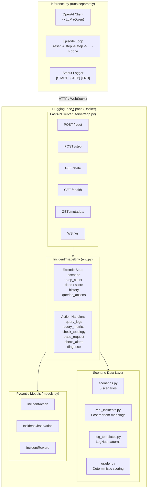
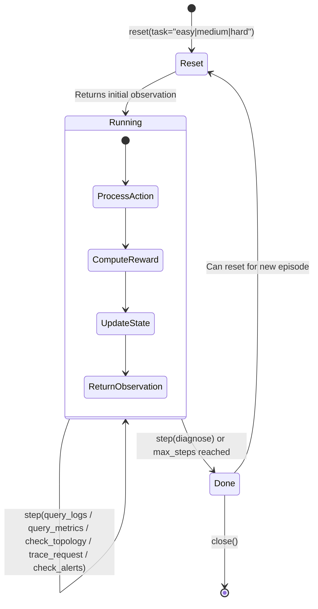
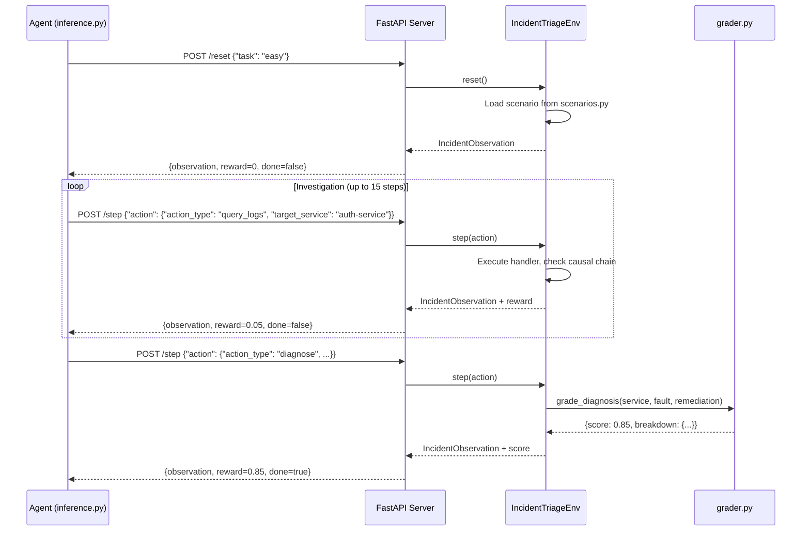
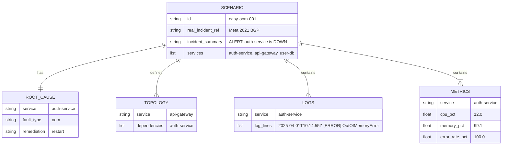
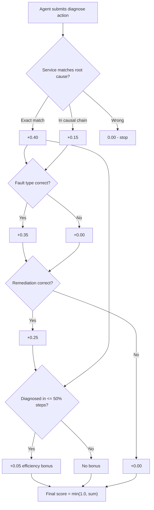
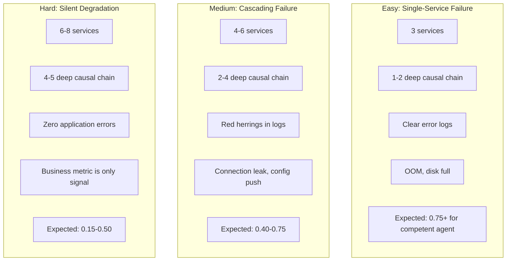

# Architecture

## System Overview

## Episode Lifecycle

## Request Flow

## Scenario Data Model

## Grading Logic

Final score = 75% diagnosis + 25% investigation quality - blind penalty

## Difficulty Progression

## File Responsibilities

| File | Role | Key Constraint |
|------|------|---------------|
| `models.py` | Pydantic models extending openenv types | Fully typed, all fields documented |
| `incident_triage_env/env.py` | Core environment with reset/step/state | Clean state management, proper episode boundaries |
| `incident_triage_env/scenarios.py` | 5 scenario definitions with logs, metrics, topology | Grounded in real post-mortems |
| `incident_triage_env/grader.py` | Deterministic scoring | Same inputs always produce same outputs, range [0.0, 1.0] |
| `incident_triage_env/real_incidents.py` | Maps real outages to scenario structures | Source of truth for incident patterns |
| `incident_triage_env/log_templates.py` | Realistic log generators from LogHub | Timestamps, thread IDs, stack traces |
| `server/app.py` | FastAPI server via create_app() | HTTP + WebSocket + MCP |
| `server/incident_triage_environment.py` | OpenEnv Environment adapter | Bridges env.py to openenv interface |
| `inference.py` | Baseline LLM agent | Exact [START]/[STEP]/[END] stdout format |
| `client.py` | EnvClient for WebSocket sessions | Typed step/reset/state |
