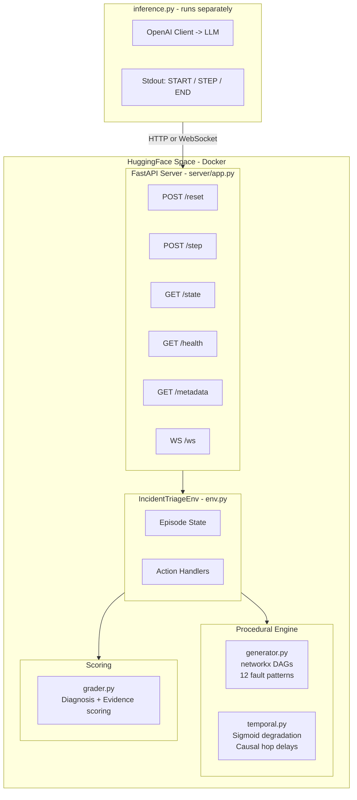
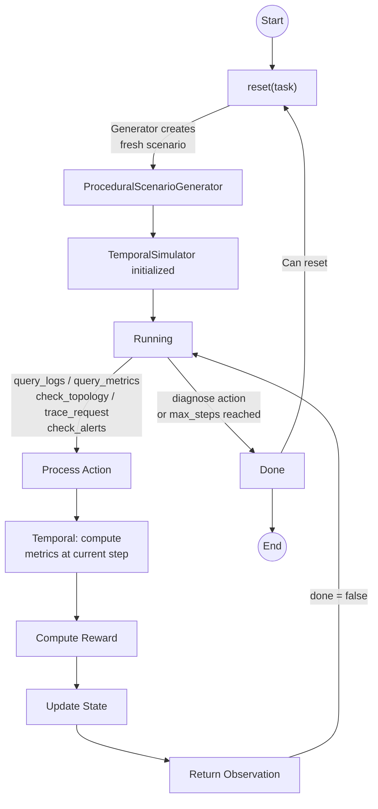
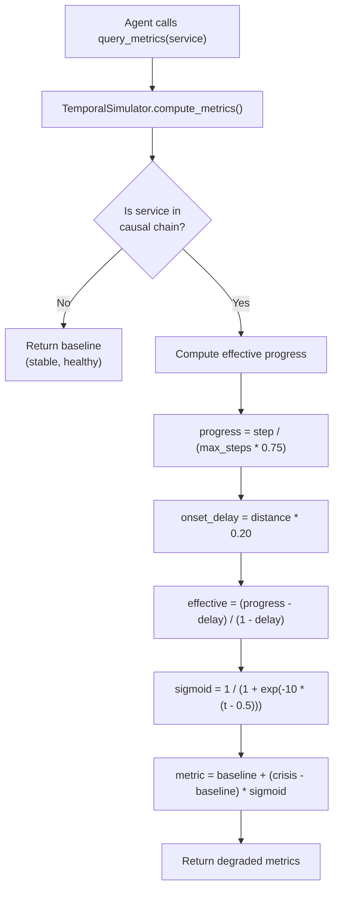
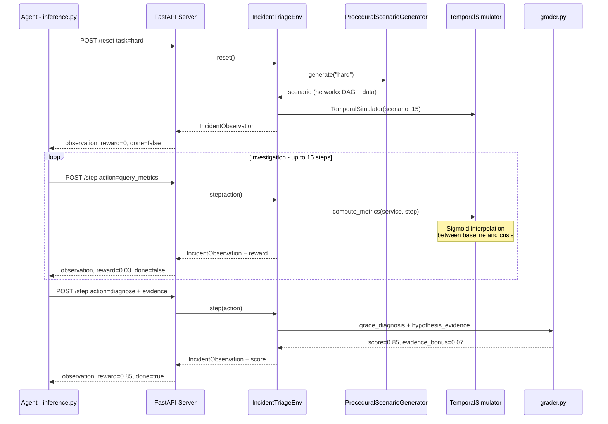
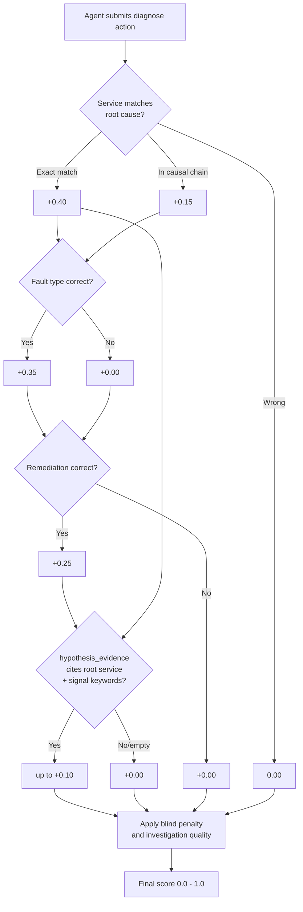

# Architecture

## System Overview

## Research Grounding

The architecture is informed by three lines of research in microservice observability and root-cause analysis:

- **Graph-structured multi-modal RCA.** Frameworks like MicroHECL (Li et al., FSE 2022) and CHASE (Wang et al., 2023) localize faults by combining service call graphs with metrics, logs, and traces. Our environment mirrors this structure: agents receive DAG topology, temporal metrics, log evidence, alerts, and traces as separate observation modalities.
- **Production microservice trace analysis.** Studies of Alibaba-scale call graphs (Luo et al., ACM SoCC 2021) show heavy-tailed, tree-like DAGs with hotspot services. Our networkx generator produces topologies with these properties while remaining fully procedural and deterministic.
- **Temporal anomaly detection.** GCN+LSTM frameworks for trace anomaly detection operate on evolving metric streams over service graphs. Our TemporalSimulator produces sigmoid degradation with causal hop delays, creating the same "moving target" that temporal anomaly detectors are designed for.

## Episode Lifecycle

## Procedural Generation

```mermaid
flowchart LR
    subgraph INPUT["Configuration"]
        DIFF["difficulty:\neasy/medium/hard"]
        SEED["optional seed\nfor reproducibility"]
    end

    subgraph GENERATOR["ProceduralScenarioGenerator"]
        FP["Pick fault pattern\n(10 available)"]
        TOPO["Build networkx DAG\n(3-9 services)"]
        RC["Select root cause\n+ causal chain"]
        SYNTH["Synthesize:\nlogs, metrics,\nalerts, traces"]
    end

    subgraph OUTPUT["Scenario Dict"]
        SVC["services + topology"]
        BASELINE["metrics_baseline\n(healthy state)"]
        CRISIS["metrics_crisis\n(full cascade)"]
        LOGS["logs per service"]
        CHAIN["causal_chain +\ncausal_distances"]
    end

    INPUT --> GENERATOR
    GENERATOR --> OUTPUT
```

## Temporal Degradation Model

### Sigmoid Curve

At each step, the effective degradation follows a sigmoid:

- Steps 0-3: slow onset (metrics near baseline)
- Steps 4-8: rapid escalation (metrics climbing fast)
- Steps 9-12: plateau near crisis values

Services further from root cause start degrading later (20% delay per hop).

## Request Flow

## Grading Logic

Final score = 70% diagnosis + 30% investigation quality + complexity nudge - blind penalty

Anti-reward-hacking: evidence grounding (must have queried cited service), keyword stuffing detection (3+ fault type keywords halves bonus), input validation (invalid fault_type/remediation rejected with -0.02).

## Difficulty Progression

```mermaid
flowchart LR
    subgraph Easy["Easy"]
        E1["3-4 services"]
        E2["1-2 deep chain"]
        E3["Clear error logs"]
        E4["OOM, disk full, cert expiry"]
    end

    subgraph Medium["Medium"]
        M1["4-6 services"]
        M2["2-4 deep chain"]
        M3["Red herrings + noise alerts"]
        M4["Connection leak, config push, thundering herd"]
    end

    subgraph Hard["Hard"]
        H1["6-9 services"]
        H2["3-5 deep chain"]
        H3["Monitoring blindness + stale metrics"]
        H4["Kafka staleness, DNS failure, memory leak, deadlock"]
    end

    Easy --> Medium --> Hard
```

## File Responsibilities

| File | Role | Key Constraint |
|------|------|---------------|
| `models.py` | Pydantic models extending openenv types | Fully typed, includes hypothesis_evidence |
| `incident_triage_env/env.py` | Core environment with reset/step/state | Integrates generator + temporal simulator |
| `incident_triage_env/generator.py` | Procedural scenario generation | networkx DAGs, 12 fault patterns, 40+ service names |
| `incident_triage_env/temporal.py` | Dynamic metric degradation | Sigmoid curves, causal hop delays |
| `incident_triage_env/grader.py` | Diagnosis + evidence + criticality + investigation scoring | Deterministic, range [0.0, 1.0], partial credit |
| `incident_triage_env/scenarios.py` | Scenario accessor (delegates to generator) | Backward compat pool lists |
| `incident_triage_env/log_templates.py` | Realistic log generators from LogHub | Timestamps, thread IDs, stack traces |
| `server/app.py` | FastAPI server via create_app() | HTTP + WebSocket + MCP |
| `server/incident_triage_environment.py` | OpenEnv Environment adapter | Bridges env.py to openenv interface |
| `inference.py` | Baseline LLM agent | Temporal-aware prompting, evidence citation |
| `scripts/chaos_evaluator.py` | Stress test harness | Hallucination detection, loop tracking |
